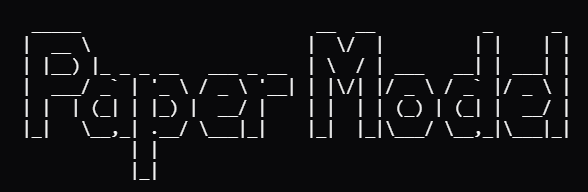

A simple rule-based model to generate realistical newspapers' pages for the training of the YOLO-Layout model.

## Generative pipeline

Fixing fonts type, columns dimension, fonts dimension.

1. Generating header / not header
2. Generating footer / not footer
3. Generating sections inside the remaining space using a recursive split of the space in sub-rectangles.
4. Generate each section

## Header generator

The header generation can be the composition of realistic newspaper names using important fonts plus some information about the cost, the date and so on.

## Section generation

1. Generating the columns
2. Positioning random boxes (they could be images or advertisements)
3. Generate articles and position them filling the columns

## Article generation

1. Random title
2. Random subtitle (not mandatory)
3. Random corpus
4. Random author (not mandatory)

## Advertisement generation

1. Random image
2. Random text in a box

## Data used for generation

In order to generate the articles and the images it makes sense to use historical data that can be found in project like the Guthemberg one or something like this.\
By the way it makes sense to begin with random images and random text.

## Structure

```bash
├── configs/                  # Folder containing configs files divided by type of newspaper
     ├── historical/ 
          └──  config.json
     └── ...
├── css/                      # Folder containing dynamic-css files
     ├── components/          # Folder containing dynamic-css for specific newspaper components
          └──  ...
     ├── theme/               # Folder containing dynamic-css for specific newspaper's theme
          └──  ...
     ├── layout.css           # Universal css file for every newspaper  
     └── base.css             # Universal css file for every newspaper
├── fonts/                    # Folder containing fonts divided by type of newspaper
     ├── historical/          # Folder containing fonts divided by type of text
          ├── title/          
               ├── font.ttf
               └── ...
          └── ...
     └── ...
├── src/                      # Folder containing the code base
     ├── article.py           # Article module
     ├── augmenting.py        # Augmenting realness module
     ├── banner.py            # Banner module
     ├── extractor.py         # Exctrator of YOLOv10 annotation module
     ├── footer.py            # Footer module
     ├── header.py            # Header module
     ├── page.py              # Page module
     ├── section.py           # Section module
     └── utils.py             # Utils (such as randomdatetime)
└── README.md
```
